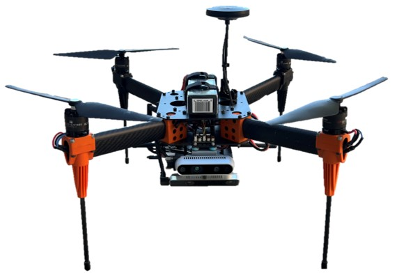

# neptune-ros




## How to run

### 1) PX4 Autopilot:
1. Connect to PX4 Autopilot (Xavier Drone)
```bash
roslaunch neptune_ros connect_px4_xavier.launch
```

2. Connect to PX4 Autopilot (Simulation-in-the-loop)
```bash
cd ~/Github/PX4-Autopilot
export PX4_HOME_LAT=38.588156
export PX4_HOME_LON=-121.705512
export PX4_HOME_ALT=28.5
make px4_sitl_default gazebo

roslaunch neptune_ros connect_sitl.launch
```
 
3. Connect to PX4 Autopilot (Hardware-in-the-loop)
```bash
cd ~/Github/PX4-Autopilot
DONT_RUN=1 make px4_sitl_default gazebo
source Tools/setup_gazebo.bash $(pwd) $(pwd)/build/px4_sitl_default
gazebo Tools/sitl_gazebo/worlds/hitl_iris.world

roslaunch neptune_ros connect_hitl.launch
```

### 2) PX4 Offboard Mode:
```bash
# Need to run before entering Offboard mode!
# Use RC CH7 to switch to Offboard Mode

rosrun px4_offboard forward_flight 
```

### 3) Rtabmap SLAM:
```bash
# Mapping
roslaunch neptune_ros stereo_mapping.launch

# Localization
roslaunch neptune_ros stereo_localization.launch
```

### 4) VIO:
```bash
# only work with PX4
roslaunch neptune_ros bridge_t265.launch
```

### 5) TensorRT:
```bash
# Convert pytorch model to tensorrt model
cd ./script/tensorrt
python3 pytorch_to_trt.python3

# Check the runtime performance
python3 runtime_compare.py
```

## Example

### 1) Run SLAM Navigation
```bash
# connect to two cameras
roslaunch neptune_ros rs_two_cameras.launch

# connect to pixhawk
roslaunch neptune_ros connect_px4_xavier.launch

# run PX4 VIO
roslaunch neptune_ros bridge_t265.launch

# run forward flight mode
rosrun px4_offboard forward_flight

# logging
roslaunch neptune_ros record_bag_slam.launch
```

### 2) Run GPS Navigation
```bash
# connect to two cameras
roslaunch neptune_ros rs_d435i.launch

# connect to pixhawk
roslaunch neptune_ros connect_px4_xavier.launch

# run forward flight mode
rosrun px4_offboard forward_flight

# logging
roslaunch neptune_ros record_bag_gps.launch
```

## Known Issues
In vision_to_mavros -> CMakeLists.txt
Comment out line 149-152